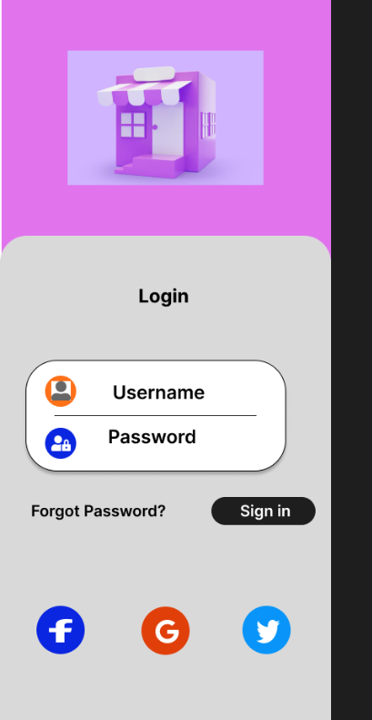
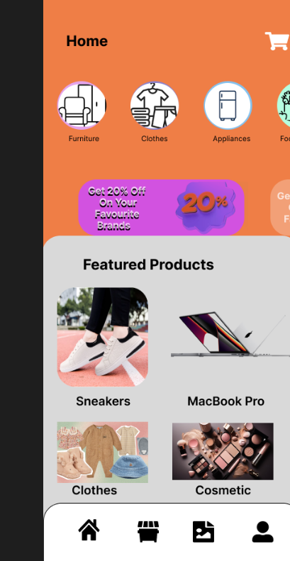
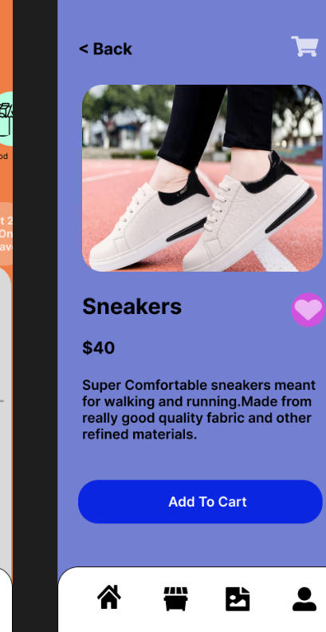
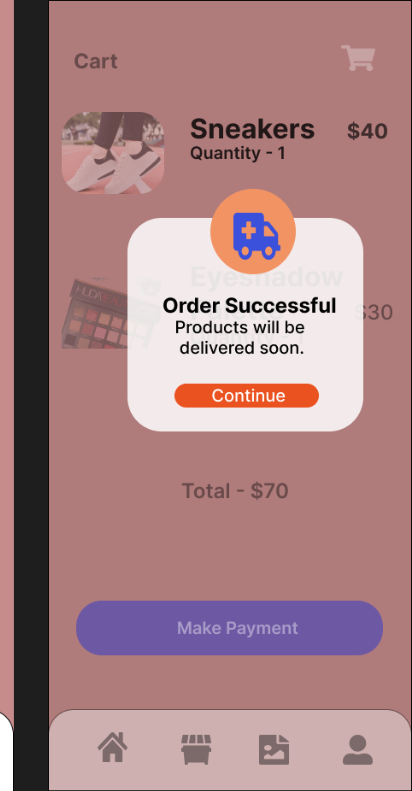

# E-Commerce-Mobile-App-UI-Design---Figma-Prototype
This project is a mobile e-commerce app UI design created using Figma.

 Users can:
Log in using username/password or social media
Explore featured products like sneakers, cosmetics, and electronics
View product details and add items to cart
Make payments and receive order confirmation

## 📸 UI Screens Preview

<table>
  <tr>
    <td><b>Login</b></td>
    <td><b>Home</b></td>
    <td><b>Product Detail</b></td>
  </tr>
  <tr>
    <td></td>
    <td></td>
    <td></td>
  </tr>
  <tr>
    <td><b>Cart</b></td>
    <td><b>Order Success</b></td>
    <td></td>
  </tr>
  <tr>
    <td></td>
    <td></td>
    <td></td>
  </tr>
</table>

## 📸 Preview

## 🔗 Live Prototype (Figma)

🔧 Tools Used:
Figma
UI/UX Design Principles

📱 Screens Included:
Login Page
Home (Featured Products)
Product Details
Cart View
Order Successful Popup
